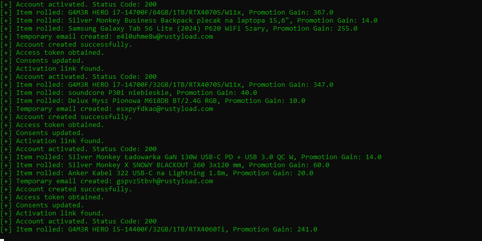

# Xkom UnBoxer
program do masowego tworzenia kont i otwierania boxów. (spk?)




## Features
- Automatycznie generuje polskie imiona i nazwiska do rejestracji kont.
- Automatyczne tworzenie kont
- Automatyczna weryfikacja newsellera
- Automatyczne otwierania boxów
- Pobieranie najnowszego api keya.
- Discord Webhook
- Proxy support

## Wymagania

- Python 3.x

## Instalacja

```bash
git clone https://github.com/antipaster/x-kom-unboxer.git
cd x-kom-unboxer
pip install -r requirements.txt
```
2. Dodaj proxy do proxy.txt zgodnie z formatem.
