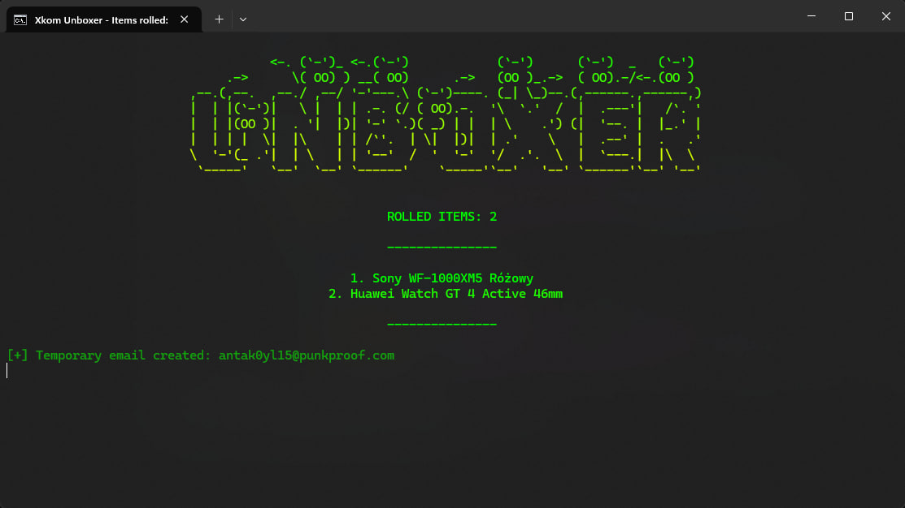

# Xkom UnBoxer
program do masowego tworzenia kont i otwierania boxów.

## Updated 25.06.2025 
- Updated the unboxer for the new X-kom api's 
- Also reworked the ui




## Features
- Automatycznie generuje polskie imiona i nazwiska do rejestracji kont.
- Automatyczne tworzenie kont
- Automatyczna weryfikacja newsellera
- Automatyczne otwierania boxów
- Pobieranie najnowszego api keya.
- Discord Webhook
- Proxy support

## Wymagania

- Python 3.x
- Polskie proxy (najlepiej residential)

## Instalacja

```bash
git clone https://github.com/antipaster/xkom-unboxer.git
cd x-kom-unboxer
pip install -r requirements.txt
```
2. Dodaj proxy do proxy.txt zgodnie z formatem. 
